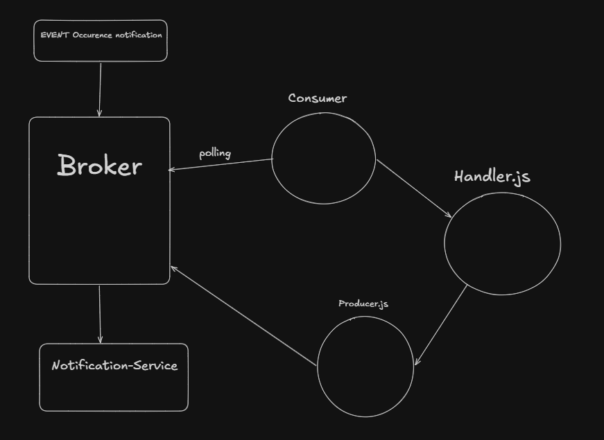

Task 1 work flow

For sending notification to users we use Kafka 
and for notification to publisher of fanFic we have to make opbject for each Publisher and this is basic flow of the Task.

Task 2 Flow

Used `node-cron` for scheduling background jobs such as:
A scheduled job in scheduler.js runs a reporting script once every
24 hours. This script connects to the database to count key metrics from the last day, such as the number of unique users notified and a breakdown of notification types. The scheduler simply acts as a timer, keeping the database logic separate in the reporting script.

