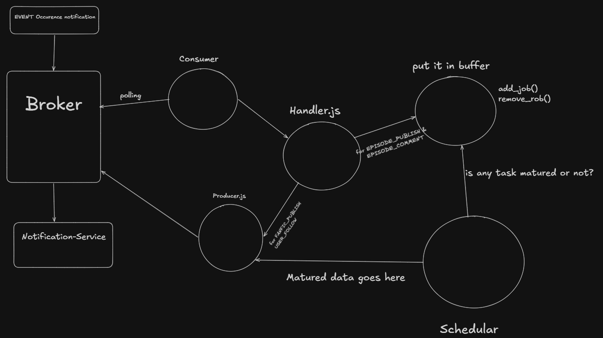

### Task 1 work flow

For sending notification to users we use Kafka 
and for notification to publisher of fanFic we have to make opbject for each Publisher and this is basic flow of the Task.

### Task 2 Flow

Used `node-cron` for scheduling background jobs such as:
A scheduled job in scheduler.js runs a reporting script once every
24 hours. This script connects to the database to count key metrics from the last day, such as the number of unique users notified and a breakdown of notification types. The scheduler simply acts as a timer, keeping the database logic separate in the reporting script.

### Task 3: Notification Buffering and Grace Period

To prevent sending notifications for content that is deleted immediately after being posted, this service implements a buffering mechanism. This provides a "grace period" for actions, ensuring users don't receive notifications for content that was quickly removed.

**How It Works:**

1.  **Buffering Events**: When an `EPISODE_PUBLISH` or `EPISODE_COMMENT` event is received, it is not handled instantly. Instead, it is added as a job to an in-memory buffer with a timestamp.
    *   New episodes are held for **5 minutes**.
    *   New comments are held for **60 seconds**.

2.  **Handling Deletions**: If a corresponding `EPISODE_DELETE` or `COMMENT_DELETE` event arrives while the job is still in the buffer, the job is removed, effectively cancelling the notification.

3.  **Processing Matured Jobs**: A background scheduler runs every 10 seconds to check the buffer. If a job's grace period has passed, the scheduler processes it, and the notification is generated and sent.

**Data Structure Choice:**

A JavaScript `Map` was chosen for the buffer due to its high performance for this specific task. It provides instant O(1) time complexity for adding, retrieving, and—most importantly—deleting jobs by their unique ID. This ensures that the cancellation process is fast and efficient, even under heavy load. 

### Event Types used and End points used in the code

### Event types and their corresponding eventDetails shape
FANFIC_PUBLISH
fanficId: string (fanfic_id)

EPISODE_PUBLISH
fanficId: string(fanfic_id)
episodeNumber: number

FANFIC_FOLLOW
fanficId: string (fanfic_id)
followerId: string (user_id)

EPISODE_COMMENT
fanficId: string(fanfic_id)
commentId: string (comment_id)
episodeNumber: number
commenterId: string (user_id)
commentText: string

USER_FOLLOW
	userId: string (user_id)
	followerId: string (user_id)

UNSUBSCRIBE
	userId: string (user_id)

RESUBSCRIBE
	userId: string (user_id)

DELETE_EPISODE
fanficId: string (fanfic_id)

DELETE_COMMENT
commentId: string (comment_id) 

### Upstream API Handlers

GET /users/{user_id}/followers
returns {page: Array<string> (user_id), cursor: string, hasMore: boolean}

GET /fanfics/{fanfic_id}/followers
returns {page: Array<string> (user_id), cursor: string, hasMore: boolean}

GET /fandoms/{fandom_id}/followers
returns {page: Array<string> (user_id), cursor: string, hasMore: boolean}

GET /fanfics/{fanfic_id}
returns {creators: Array<string> (user_id), fanficName: string, fanficDescription: string, fandoms: Array<string> (fandom_id)}

GET /fanfics/{fanfic_id}/episodes/{episode_number}
returns {episodeDescription: string}
Note: episodes are always attributed to the same creators as of the fanfic to which they belong.

GET /users/{user_id}
returns {nickname: string}
